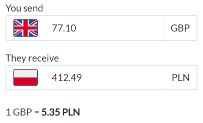

# Currency converter


> To convert values, the application takes data from an external api
> [_NBP Web API_](http://api.nbp.pl/). The user can enter numbers into either of the two fields as strings.

## Setup

1. **Clone the repository**
    ```bash
     git clone https://github.com/krzysztofplatek/currency-converter.git
   ```

2. **Run the Spring Boot app**

   ```bash
   mvn spring-boot:run
   ```

   The server will start on port `8080`.


3. **Run the React app**

   ```bash
   cd converter-client
   npm install
   npm start
   ```

   The front-end server will start on port `3000`.

## Technologies Used

* Java
* Spring Boot
* JavaScript
* React
* Lombok

## Features

* Conversion of currency values between PLN and GBP
* Edge cases handled, user can't enter invalid value


## Future development

* Add more currencies so that the user can choose which values to convert